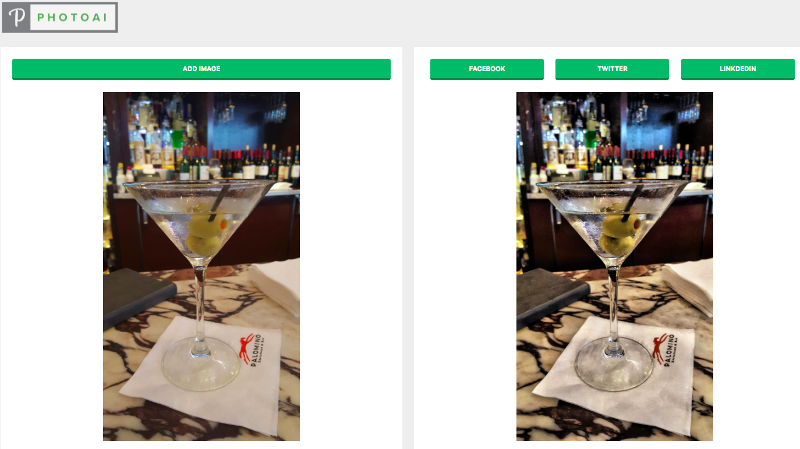
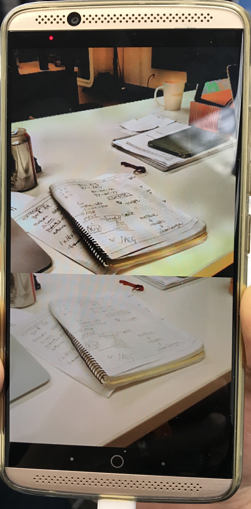
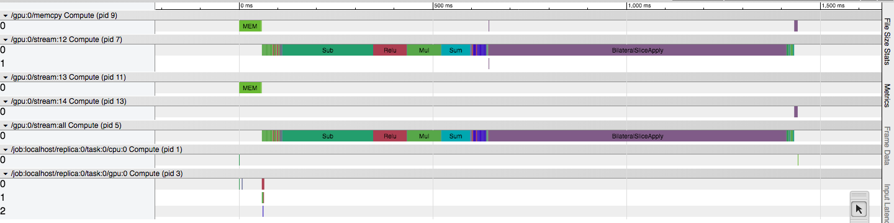
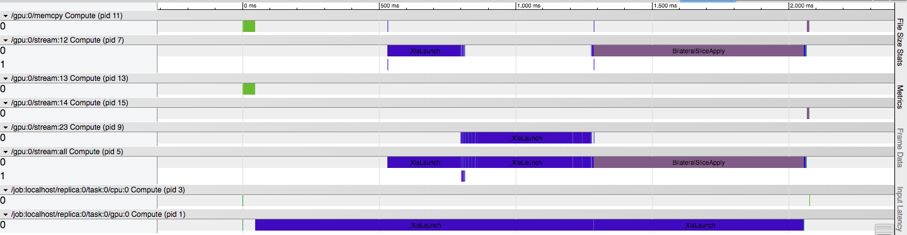

# Real-time image enhancement DL android App and web App
An deep learning project focusing on deploying pretrained models on mobile device and cloud. It's implemented during 3 weeks Insight AI fellowship program.

The pretrained models give credit to [Deep Bilateral Learning
for Real-Time Image Enhancement](https://groups.csail.mit.edu/graphics/hdrnet/)   

## Setup

### Dependencies

To install the Python dependencies, run:

    pip install -r requirements.txt

## Usage

To download the pretrained models, please refer to [Deep Bilateral Learning
for Real-Time Image Enhancement](https://groups.csail.mit.edu/graphics/hdrnet/)

To prepare a model for use on mobile, freeze the graph, and optimize the network:

    ./scripts/freeze_graph.py <checkpoint_dir>
    ./scripts/optimize_graph.py <checkpoint_dir>
    
To test the prepares model for use on web app or mobile:
    
    ./scripts/test_pb_graph.py <chechpoint_dir>

## Serving the Hdrnet model on cloud

  

### [photoAI](http://photo-ai.surge.sh/)

Now this web app 'photoAI' are serving 3 different pretrained models: face brightening, edge enhancing, hdr+

## Deloy Hdrnet model on android by Tensorflow mobile

In order to deploy this model on android, I have to implement a custom tensorflow op (CUDA version) by opencl so that the op can run on mobile.
Need to clean some code, to be updated.

  

## Inference performance comparison with and without XLA

Some tests with XLA fused operation optimization. Images below shows tests with 1 batch (20) 1500*1000 pictures. Didn't see any improvements by using XLA. I think there are mainly two reasons: bilateralSliceApply is a very heavy computation custom op, and cannot be fused by XLA; XLA is still at early stage.

Inference without XLA JIT

    

Inference with XLA JIT

    

## Known issues and limitations

* Tensorflow mobile doesn't support custom op, especially for ops implemented in CUDA. The hdrnet model used a custom op - BilateralSliceApply op - is GPU only.

* The pre-trained HDR+ model trained on a specially formatted 16-bit linear input. When feeding general images will receive outputs with weird color.